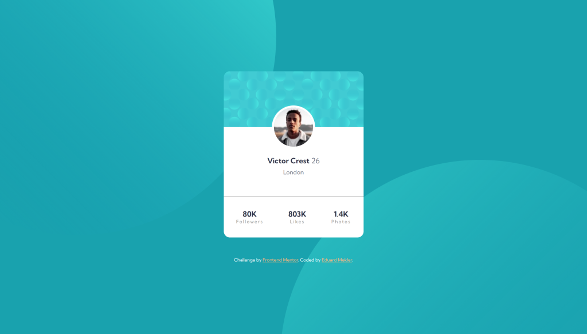
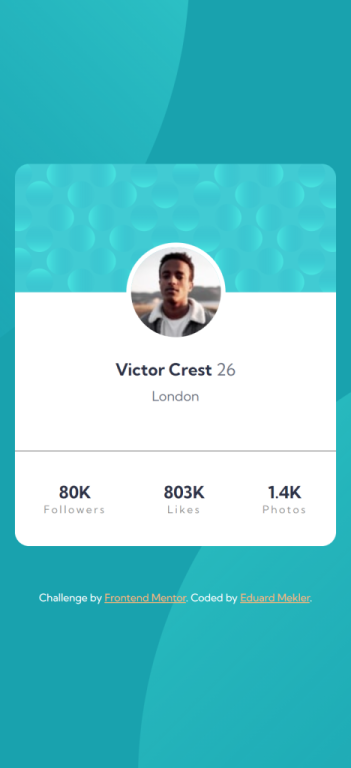

# Frontend Mentor - Profile card component solution

This is a solution to the [Profile card component challenge on Frontend Mentor](https://www.frontendmentor.io/challenges/profile-card-component-cfArpWshJ). Frontend Mentor challenges help you improve your coding skills by building realistic projects. 

## Table of contents

- [Overview](#overview)
  - [The challenge](#the-challenge)
  - [Screenshot](#screenshot)
  - [Links](#links)
- [My process](#my-process)
  - [Built with](#built-with)
  - [Continued development](#continued-development)
- [Author](#author)

## Overview

### The challenge

- Build out the project to the designs provided

### Screenshot

### Links

- Solution URL: [GitHub](https://github.com/emekler0729/fem-profile-card-component)
- Live Site URL: [GitHub Pages](https://emekler0729.github.io/fem-profile-card-component/)

## My process

### Built with

- Semantic HTML5 markup
- Sass
- Flexbox
- Mobile-first workflow

### Continued development

I was not satisfied with the way that background positioning worked in this exercise. I thought that using percentages would have made it easier for the background circles to stay on the edges of the component card, but instead I had to manually identify and create a few responive breakpoints. Additionally, the background images move in relationship to the component card in between breakpoints.

For continued development, I would further research this so that the background was more fluid responsive.

## Author

- Website - [Eduard Mekler](https://www.eduard-mekler.com)
- Frontend Mentor - [@emekler0729](https://www.frontendmentor.io/profile/emekler0729)

